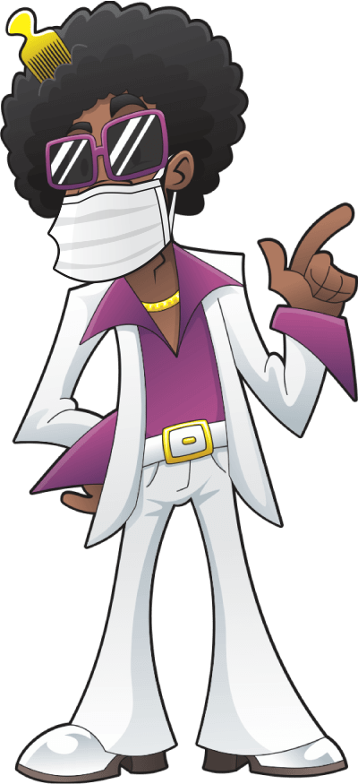

<p align="center">
  
</p>

<h3 align="center">
  A Discord Bot that retrieves Posts from AhNegao (https://www.ahnegao.com.br) to a Discord Channel 🤖
</h3>

<p align="center">
	<a href="https://github.com/guilhermebkel/ah-negao-discord-bot">
		
	</a>
	<a href="https://github.com/microsoft/TypeScript">
		
	</a>
</p>

## 📌 Overview

AhNegaoDiscordBot uses web scraping in order to fetch the posts of current day from **https://www.ahnegao.com.br** and then, if they were not posted yet on the selected discord channel, he does it.

## 🔧 Technologies

- Typescript

## 🚀 Getting started

1. Clone this repository.

2. Install all dependencies:
```sh
npm install
```

3. Create an application on [Discord for Developers](https://discordapp.com/developers/).

4. On the aside menu, go into the **Bot**, create a new bot and mark the option **Public Bot**.

5. On the aside menu, go into the **OAuth2** option and mark the following options:

> On **SCOPES** table mark: **bot**
>
> On **BOT PERMISSIONS** mark: **Send Messages, Read Message History**

6. Use the link below **SCOPES** to add the bot to your server.

7. On the aside menu, go into the **Bot** option and click on **Copy** in the side of your bot avatar to copy the bot token.

8. Go back to the repository you cloned on your machine, duplicate the .env.example into a .env file and fill the required variables:
```
DISCORD_BOT_TOKEN= 
DISCORD_CHANNEL_NAME=
```

9. Run the application:
```sh
npm run dev
```